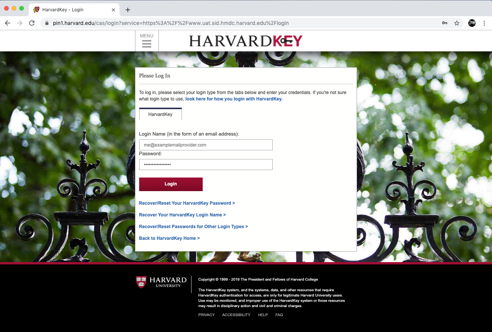

# Sid Quickstart

## Requirements

All that is needed is a reasonably recent browser \(Chrome, Firefox, Safari, Opera, Internet Explorer\) on a desktop system \(MacOS, Windows, Linux\).

## Getting Access

If you have a Harvard email, file a request ticket for Sid access in [the IQSS Request Tracker \(RT\) system](https://help.hmdc.harvard.edu).

## Launching a Job

### Launch the [sign-in screen](https://uat.sid.hmdc.harvard.edu)

### Sign-in Through [Harvard Key](https://www.pin1.harvard.edu/cas/login?service=https%3A%2F%2Fwww.uat.sid.hmdc.harvard.edu%2Flogin)

### Launch an Interactive Application from [the Dashboard](https://www.uat.sid.hmdc.harvard.edu/#!/dashboard)

### [Select CPU and RAM requirements](https://hmdc.gitbook.io/sid/determining-resource-requirements)

### View the Application\(s\) in the [Dashboard](https://www.uat.sid.hmdc.harvard.edu/#!/dashboard)

### Access the Desktop application from the link in the jobs dashboard

### Access the RStudio application from the link in the jobs dashboard 

