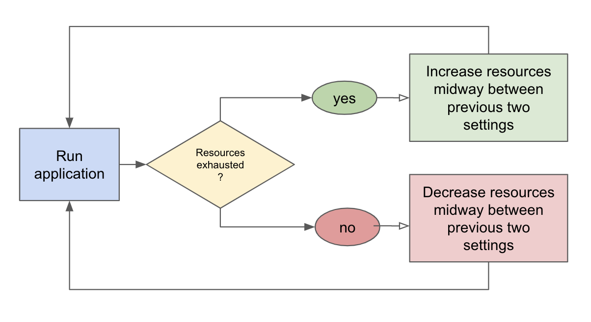

# Determining Resource Requirements

## CPU

* Multi-threading
* Parallelization
* Refactoring

## RAM

### Static analysis

Find the _**main**_ looping portion of your application, and determine the total size \(in bytes\) of all your variables.  Are you reading in chunks of data \(e.g., line-by-line, item-by-item\), or do you slurp it all in in one single go?

### Analyze scalability

Run your application with only a tiny subset of your data and measure CPU, RAM, and disk usage.   How will the application scale?  Constant, linear, quadratic, exponential?

### Binary Search

Use [binary search](https://rosettacode.org/wiki/Binary_search) to find the optimal resource settings:

## Disk

* Ephemeral Storage
* Google Drive
* Azure \(coming soon\)

