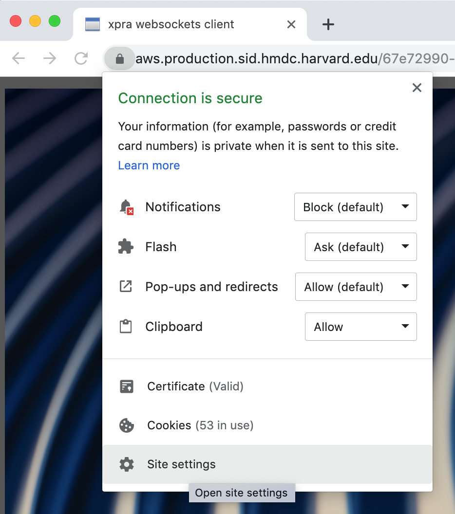
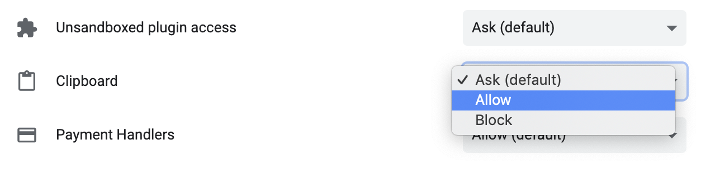
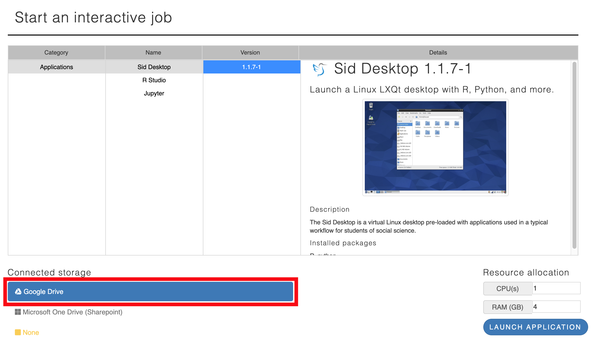
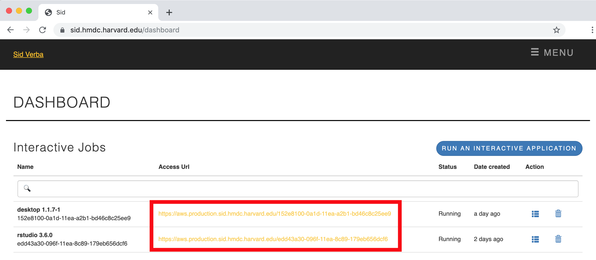
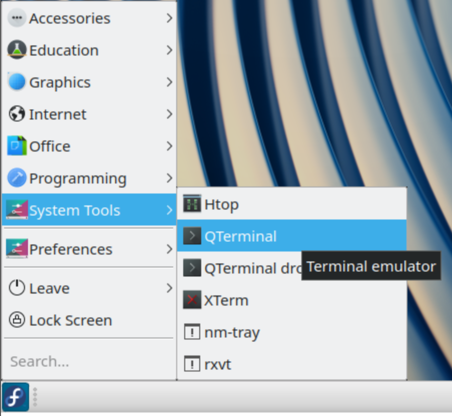
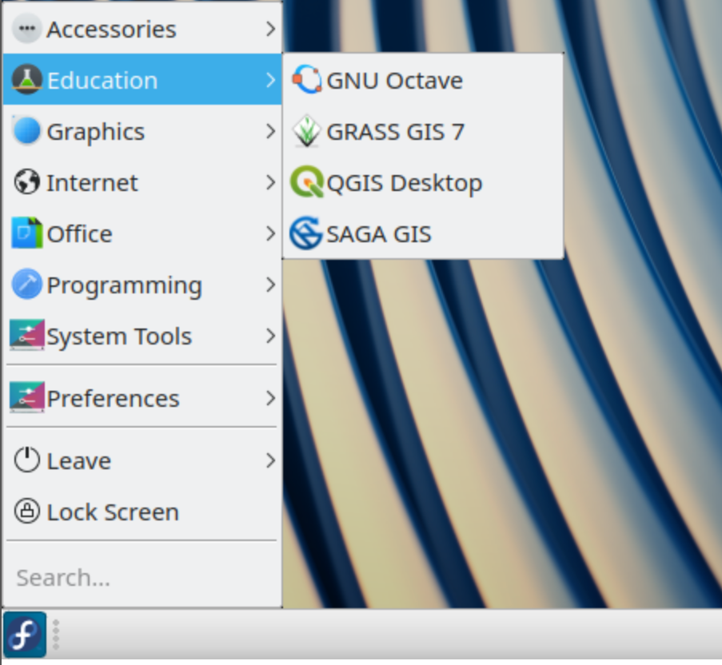
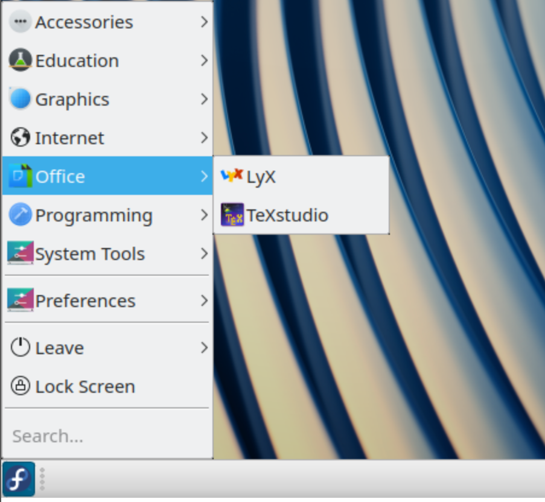
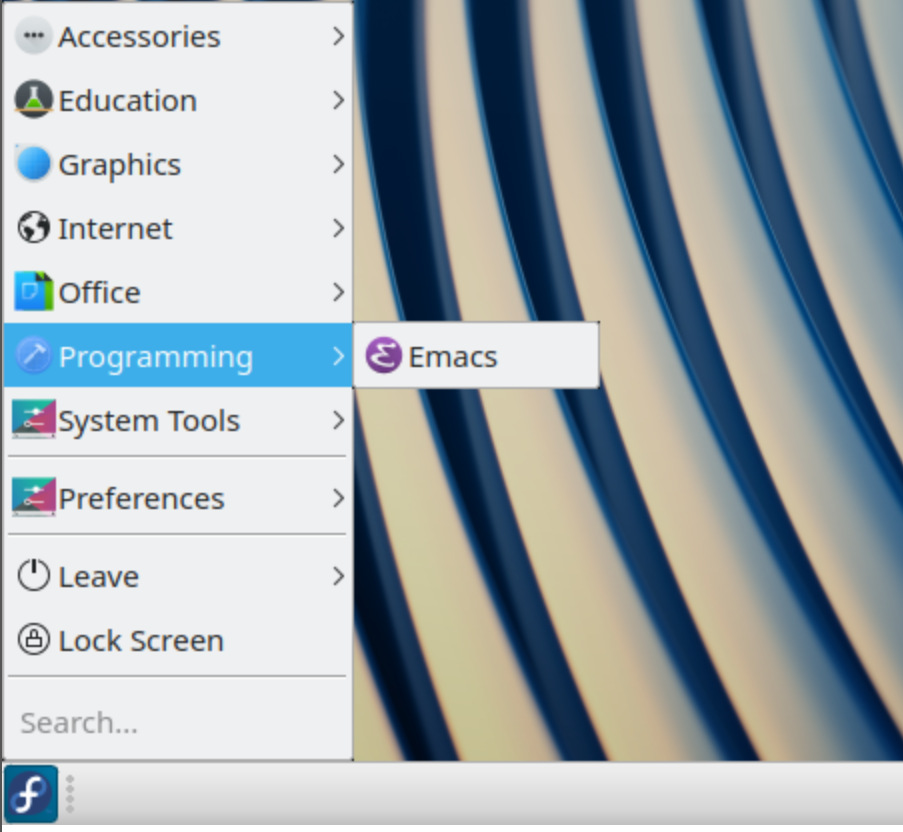
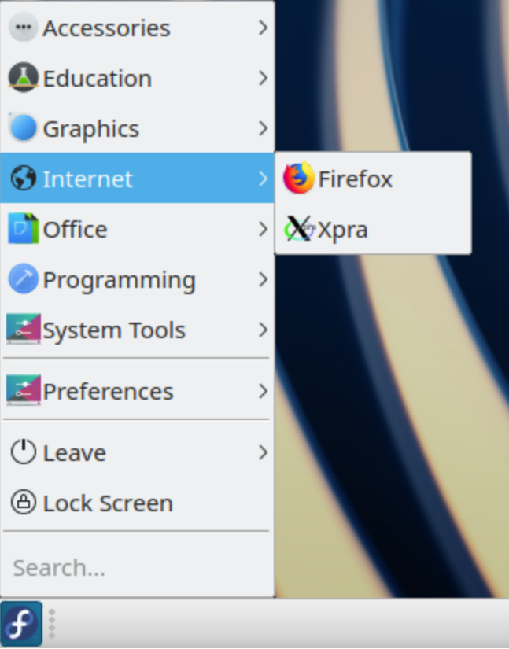

# FAQ

## What is my Sid username and password?

Your Sid credentials are your [HarvardKey](https://key.harvard.edu) e-mail address and password.

## Can I FTP files between Sid and my local computer using FileZilla or some other FTP program?

No.  Please use [Google Drive](http://drive.google.com) to transfer data into and out of your Sid session.

## How do I run a batch job?

Sid will support [classical batch-style processing](https://en.wikipedia.org/wiki/Batch_processing) in a [future release](https://github.com/hmdc/sid/issues?utf8=✓&q=is%3Aissue+is%3Aopen++batch).  Currently, batch-style jobs can run indefinitely in the background _without user input_ within an [interactive job](https://www.sid.hmdc.harvard.edu/vmSelectDedicated).

## How do I read a network file in R?

Use the [`httr`](https://www.rdocumentation.org/packages/httr/versions/1.4.1) [`GET`](https://www.rdocumentation.org/packages/httr/versions/1.4.1/topics/GET) function, e.g.,

```
library(httr)

# Example World Health data
url <- 'https://pastebin.com/raw/V7DEMiDu';
r <- GET(url)
fil <- tempfile("data")
write(content(r, "text"), fil)
WHS_data <- read.table(fil, sep="\t", header=TRUE, quote="")

summary(WHS_data[,c(1,4,10)])
pairs(WHS_data[,c(1,4,10)])
```

## How much \[ephemeral\] storage does my job have?

Use [`df`](https://linux.die.net/man/1/df) `-h` to display disk size. E.g., in the below example, the job has `92G` of disk storage under `Avail`.

```
$ df -h $HOME
Filesystem      Size  Used Avail Use% Mounted on
overlay         105G   14G   92G  14% /
```

## How do I cut and paste to and from my Sid Desktop?

Select `Site Settings`in your Sid Desktop browser tab:



Select `Clipboard` -&gt; `Allow`



Different operating systems and keyboard configurations map copy and paste differently; but it is generally one of Ctrl-C, Option-C, Alt-C, or ⌘-C for copy \(and Ctrl-V, Option-V, Alt-V, or ⌘-V for paste\).

## How do I connect my Google Drive to my Sid Job?

In the [job launcher](https://www.sid.hmdc.harvard.edu/vmSelectDedicated), select `Google Drive` under `Connected Storage`:



See [this screencast](https://d.pr/v/adp0tJ) for a demonstration of attaching a Google Drive to a Sid job.

## Will requesting more resources slow my job's performance?

No.  A CPU is a CPU and RAM is RAM.  Sid does not allocate _cheaper_, worse-performing hardware based on request size.  Additionally, running multiple jobs will not degrade performance.  Sid users can run up to eleven jobs without any performance degradation \(as each is allocated dedicated resources from AWS\).

## How do I launch an app from the Sid Dashboard?

When Sid has completed provisioning your desktop environment, a link to it will appear below `Access Url` in the dashboard:



The Sid Desktop runs LxQT, [The Lightweight Qt Desktop Environment](https://lxqt.org/).  Like all desktop environments, the left-hand corner opens a menu of useful GUI X Windows applications including web browsers, terminal emulators, text editors, LaTeX editors, and more.

### System Tools

[QTerminal](http://manpages.ubuntu.com/manpages/bionic/en/man1/qterminal.1.html) is available under System Tools.  It is a multi-tab terminal emulator, which can run command-line applications.



### Education

GNU Octave is a free alternative to [MATLAB](https://www.mathworks.com/products/matlab.html) available in the Education menu.



### Office

[LyX](https://www.lyx.org) and [TeXstudio](www.texstudio.org) are LaTeX authoring tools for academic papers.



### Programming

[Emacs](https://www.gnu.org/software/emacs/) is a popular text editor available in the Programming menu.



### Internet

The [Firefox](https://www.mozilla.org/en-US/firefox/) browser is available in the Internet menu.



## What command-line tools are available in the Sid Desktop?

The Sid Desktop has hundreds of commands pre-installed such as the following:

```text
R
docbook
emacs
gcc
git
gnuplot
imageMagick
java
lua
make
octave
perl
python2
python3
rpm
rxvt
screen
tcl
texlive
texstudio
tix
tk
tmux
vim
zip
```

The [YUM package manager](http://yum.baseurl.org/) can list, query, and add additional command-line tools to the Sid Desktop. 

