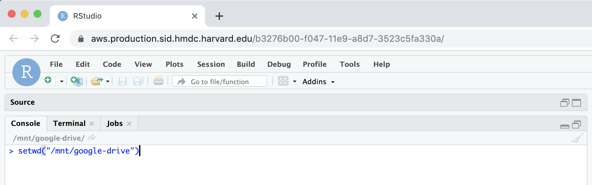
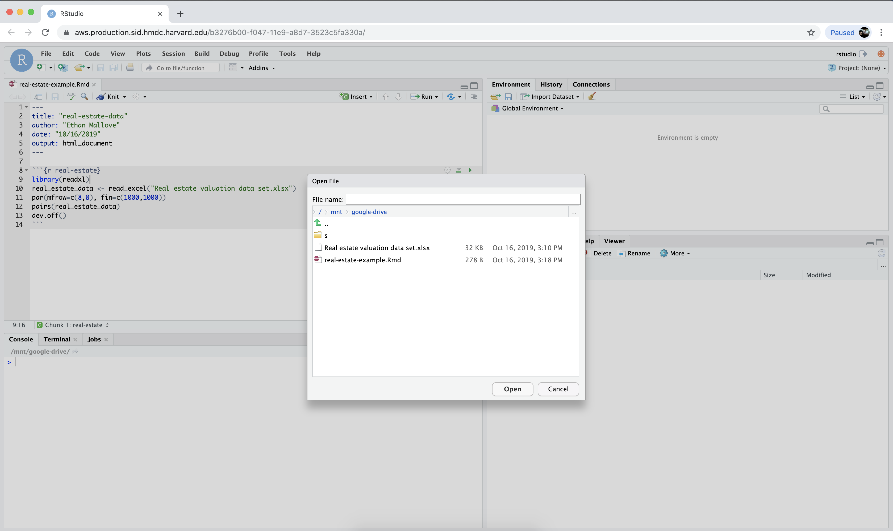

# Moving from local R-Studio to Sid R-Studio

## Drag your R and data files to your Google Drive

Alternatively, Google provides [Google Drive for Desktop](https://www.google.com/drive/download/) to sync your local files to your Google drive.

## [Launch an interactive R Studio job](https://hmdc.gitbook.io/sid/#launch-an-interactive-application-from-the-dashboard).

## Change the [working directory](https://www.rdocumentation.org/packages/base/versions/3.6.1/topics/getwd) to the Google Drive mount point:

## Select `File` -&gt; `Open File` 

## Open your Rmd file from your Google Drive:

