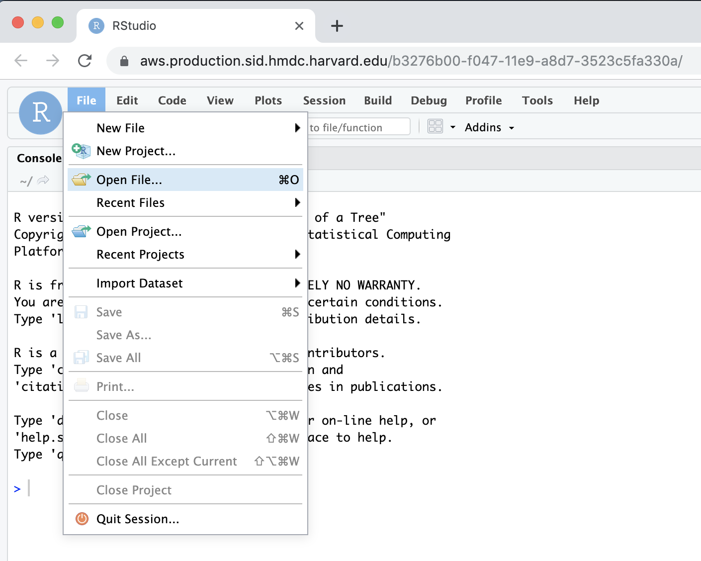

# Moving from local R-Studio to Sid R-Studio

## Upload to Drive 

Google Drive's web interface provides several ways to [upload local files to their storage service](https://support.google.com/drive/answer/2424368?co=GENIE.Platform%3DDesktop&hl=en), including drag and drop, file chooser, or using the [desktop Drive app](https://www.google.com/drive/download).

## [Launch an interactive R Studio job](https://hmdc.gitbook.io/sid/#launch-an-interactive-application-from-the-dashboard).

## Set [working directory](https://www.rdocumentation.org/packages/base/versions/3.6.1/topics/getwd)

Change the [working directory](https://www.rdocumentation.org/packages/base/versions/3.6.1/topics/getwd) to the Google Drive mount point in the R-Studio `Console` pane.

## Select `File` -&gt; `Open File` 

## Import files into RStudio from your Google Drive mount

## Setup complete

